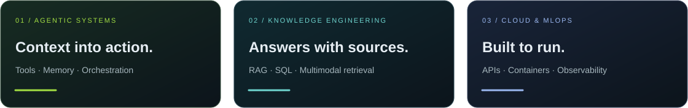
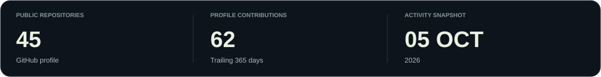
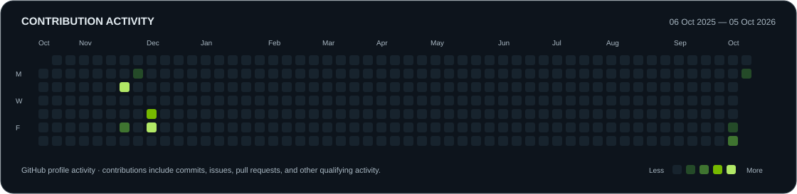
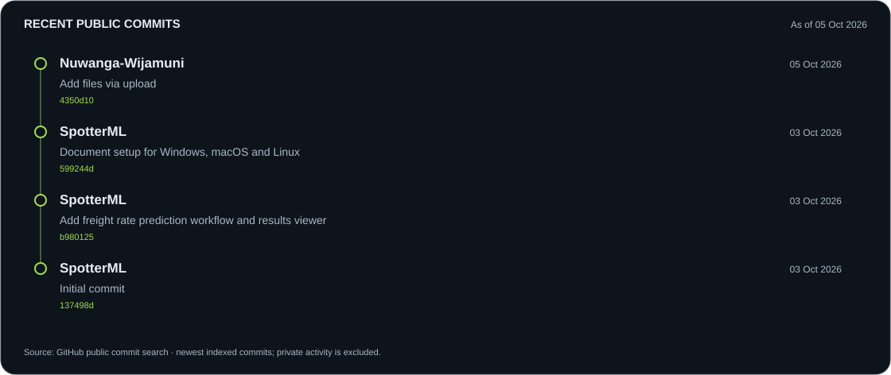
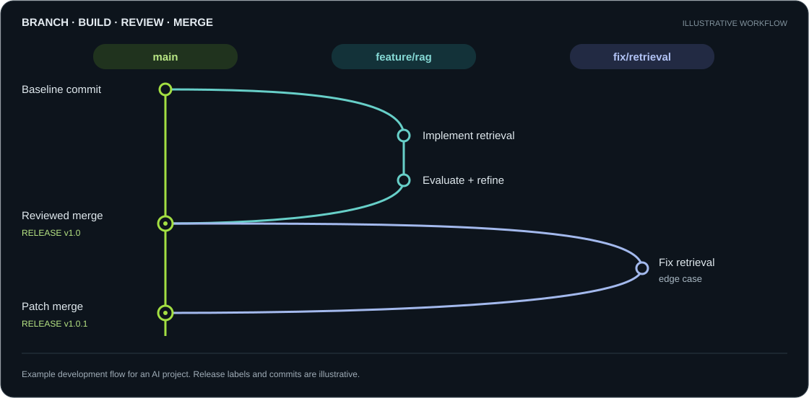
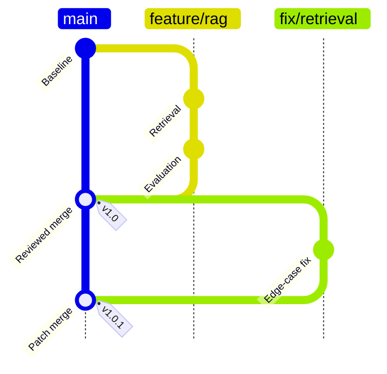
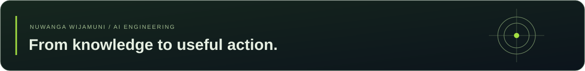

<!-- Profile repository: Nuwanga-Wijamuni/Nuwanga-Wijamuni. Upload README.md and the assets folder together. -->

  

  <strong>AI Engineer &nbsp;·&nbsp; Agentic AI &nbsp;·&nbsp; Retrieval-Augmented Generation &nbsp;·&nbsp; MLOps</strong> 
  Negombo, Sri Lanka &nbsp;/&nbsp; Enterprise knowledge · Multimodal experiences · Cloud systems

  <a href="https://www.linkedin.com/in/nuwanga-wijamuni-3bb4b8221/"><strong>LinkedIn ↗</strong></a>
  &nbsp;&nbsp; / &nbsp;&nbsp;
  <a href="mailto:nuwanga69@gmail.com"><strong>Email ↗</strong></a>
  &nbsp;&nbsp; / &nbsp;&nbsp;
  <a href="https://github.com/Nuwanga-Wijamuni?tab=repositories"><strong>Repositories ↗</strong></a>

---

  <a href="#projects"><kbd>PROJECTS</kbd></a> &nbsp;
  <a href="#nvidia"><kbd>NVIDIA AI</kbd></a> &nbsp;
  <a href="#toolkit"><kbd>TECH STACK</kbd></a> &nbsp;
  <a href="#github-activity"><kbd>COMMITS</kbd></a> &nbsp;
  <a href="#branch-workflow"><kbd>BRANCHES</kbd></a>

I build AI systems that connect **business knowledge, language models, and useful actions**. My work spans agentic retrieval, conversational interfaces, natural language-to-SQL, and the infrastructure that brings them together.

At **HSB Marine Constructions**, I work on company knowledge applications and approval-based automation. Previously, I worked in data engineering at **One Billion Tech** and data science at **MAS Holdings**.

My engineering priorities: **source-linked answers, traceable agent workflows, clear human approval points, and reproducible deployments.**

  

## 01 / Selected work

<table>
  <tr>
    <td width="50%" valign="top">
      AGENTIC RETRIEVAL
      <h3>Commerce Knowledge Agent</h3>
      
An agentic RAG system that combines product information from SQL, vector retrieval, and object storage. LangGraph coordinates the workflow; LangSmith makes agent interactions traceable.

      
<code>LangGraph</code> <code>LangChain</code> <code>Weaviate</code> <code>S3</code>

    </td>
    <td width="50%" valign="top">
      VOICE + VISUAL INTERACTION
      <h3>Gourmet Express</h3>
      
A conversational restaurant assistant that connects voice commands to a visual menu and shopping cart. Tool calls turn conversation into interface actions over WebSockets.

      
<code>Realtime API</code> <code>FastAPI</code> <code>WebSockets</code>

      
<a href="https://github.com/Nuwanga-Wijamuni/AIVisualAgent"><strong>Explore repository ↗</strong></a>

    </td>
  </tr>
  <tr>
    <td width="50%" valign="top">
      NVIDIA NIM + GEOSPATIAL AI
      <h3>GeoNIM Satellite Analyzer</h3>
      
A pipeline for multi-gigabyte satellite imagery, using image tiling and NVIDIA NIM vision-language models to extract structured environmental observations and map anomalies.

      
<code>NVIDIA NIM</code> <code>rasterio</code> <code>GeoPandas</code> <code>FastAPI</code>

    </td>
    <td width="50%" valign="top">
      DOCUMENT INTELLIGENCE
      <h3>Containerized RAG Pipeline</h3>
      
A PDF question-answering application with document extraction, chunking, embeddings, and vector retrieval. FastAPI and Docker Compose package the application for local execution.

      
<code>Weaviate</code> <code>Groq</code> <code>FastAPI</code> <code>Docker</code>

      
<a href="https://github.com/Nuwanga-Wijamuni/RAG_Docker"><strong>Explore repository ↗</strong></a>

    </td>
  </tr>
</table>

## 02 / NVIDIA · Agentic AI & local compute

**NVIDIA Agentic AI training completed.** I am interested in connecting practical agent workflows with accelerated inference, multimodal models, and local AI infrastructure.

<table>
  <tr>
    <td width="50%" align="center">
      
       <strong>DGX Spark</strong> · Desktop AI development
    </td>
    <td width="50%" align="center">
      
       <strong>Inside the platform</strong> · Grace Blackwell architecture
    </td>
  </tr>
</table>

| Focus | My work & direction |
| :--- | :--- |
| **Applied · NVIDIA NIM** | Used vision-language inference in GeoNIM for satellite-image analysis and structured JSON extraction. |
| **Built · Agentic workflows** | Combined LangGraph orchestration, retrieval tools, and LangSmith tracing; developed approval controls for business automation. |
| **Research · DGX Spark** | Investigated company workloads across documents, images, audio, and video, including laptop connectivity, fine-tuning, and image-generation requirements. |
| **Exploring · NeMo Agent Toolkit** | Interested in workflow evaluation, profiling, and observability across agent frameworks. |

My next research direction is a **local enterprise AI workbench**: document retrieval, multimodal understanding, and tool-using agents evaluated against real business tasks.

  <a href="https://www.nvidia.com/en-us/ai/"><strong>NVIDIA Agentic AI ↗</strong></a>
  &nbsp;·&nbsp;
  <a href="https://developer.nvidia.com/nim"><strong>NVIDIA NIM ↗</strong></a>
  &nbsp;·&nbsp;
  <a href="https://docs.nvidia.com/nemo/agent-toolkit/latest/index.html"><strong>NeMo Agent Toolkit ↗</strong></a>
  &nbsp;·&nbsp;
  <a href="https://build.nvidia.com/spark"><strong>DGX Spark Playbooks ↗</strong></a>

Product imagery: NVIDIA. DGX Spark is an infrastructure research interest; the images illustrate the platform.

## 03 / Engineering toolkit

  

| Layer | Technologies |
| :--- | :--- |
| **Agents & LLMs** | LangChain · LangGraph · LangSmith · NVIDIA NIM · Hugging Face Transformers · QLoRA / PEFT |
| **Retrieval & data** | Weaviate · ChromaDB · PostgreSQL · MySQL · Snowflake · SQLAlchemy |
| **Application engineering** | Python · SQL · FastAPI · Flask · Streamlit · WebSockets |
| **Cloud & deployment** | AWS SageMaker / ECR / S3 / RDS · Google Cloud Vertex AI / Cloud Run · Docker · GitHub Actions |
| **Operations & integration** | Kubernetes · KServe · MLflow · Prometheus · Grafana · Airflow · Google Drive · Asana |

  
<strong>More tools & applied methods</strong>

   
  
<strong>ML & vision:</strong> scikit-learn, OpenCV, MediaPipe, Pandas, rasterio, GeoPandas.

  
<strong>Data & analytics:</strong> Power BI, forecasting, data pipelines, query optimization, and stored-procedure logging.

  
<strong>AI application design:</strong> prompt and context engineering, hybrid conversational memory, source attribution, structured outputs, and human-in-the-loop workflows.

## 04 / GitHub activity & commits

  
  

Activity graphics are dated snapshots from GitHub. The calendar includes multiple contribution types; the timeline shows indexed public commits. <a href="https://github.com/Nuwanga-Wijamuni?tab=overview">View current GitHub activity ↗</a> · <a href="https://github.com/search?q=author%3ANuwanga-Wijamuni&amp;type=commits">Browse public commits ↗</a>

## 05 / Branches, commits & releases

An **illustrative AI development workflow**: build retrieval on a feature branch, evaluate the change, review and merge it, then deliver a focused fix. The diagram shows an example workflow, not the history of a specific repository.

  

<strong>Explore the native Mermaid branch diagram</strong>

## 06 / Experience

| Organization | Role & contribution |
| :--- | :--- |
| **HSB Marine Constructions** Oct 2025 – Present | **AI Engineer · Contract** Local company RAG application; ChatGPT–Google Drive–Asana task triage; Company Brain knowledge structures and AI architecture evaluation. |
| **One Billion Tech** Aug 2024 – Jul 2025 | **Data Engineer Intern** RAG deployment with LLaMA and Weaviate; natural language-to-SQL applications; Snowflake query optimization and data-load logging. |
| **MAS Holdings** Mar 2023 – Mar 2024 | **Data Scientist Intern** Sales forecasting with ARIMA, Prophet, and LSTM; automated data preparation; Power BI dashboards. |

## 07 / Education & credentials

- **Bachelor of Information Technology, Specialization in Data Science** — SLIIT, 2020–2024.
- **AWS Certified Data Engineer – Associate (DEA-C01)** — earned in 2024.
- **NVIDIA Agentic AI training** — completed.
- **SLIIT Datathon 2022** — finalist and merit award for an AI-based monkeypox detection model.
- **ML Nexus Quiz Competition** — second runner-up, University of Colombo.

---

  

  <strong>Let's build useful AI, with the engineering to support it.</strong>  
  <a href="mailto:nuwanga69@gmail.com">nuwanga69@gmail.com</a>
  &nbsp;·&nbsp;
  <a href="https://www.linkedin.com/in/nuwanga-wijamuni-3bb4b8221/">Connect on LinkedIn</a>

